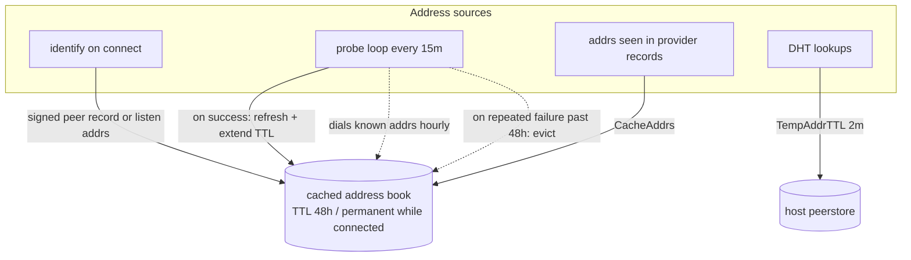
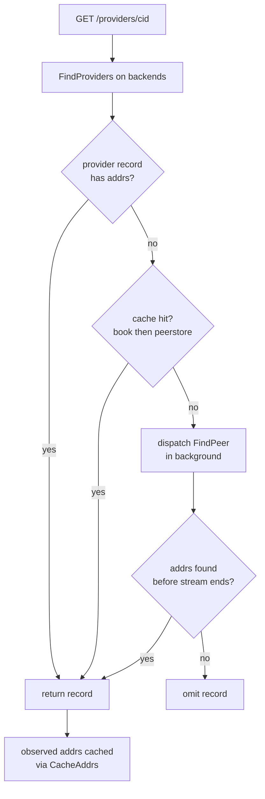
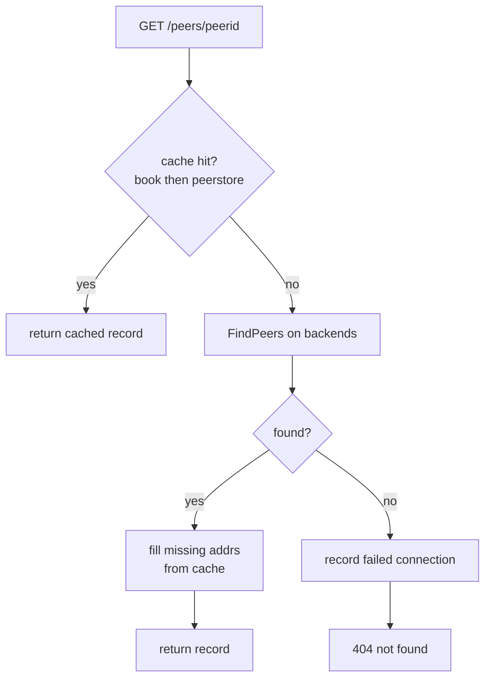

# Peer Address Caching

someguy is a caching delegated routing proxy, not a libp2p node. It answers
`/routing/v1` requests by querying backends (the Amino DHT and delegated HTTP
routers) and caching what it learns. Because it serves clients rather than
participating in the network itself, it prioritizes two things over a fresh
lookup on every request:

- **Latency.** A cached answer returns in microseconds; a DHT walk takes
  seconds.
- **Stable, reachable peers.** The cache holds peers that someguy has recently
  seen and actively probes, so cached addresses skew toward peers that are
  online right now.

This document describes how the address cache is filled, how it is kept fresh,
and how `/providers` and `/peers` read from it.

> [!NOTE]
> Address caching requires a DHT-backed instance and the `--cached-addr-book`
> flag (on by default). With `--dht=disabled`, someguy is a plain proxy:
> `/providers` and `/peers` forward to the delegated HTTP endpoints and no
> address caching takes place.

## The two stores

someguy keeps peer addresses in two places, both consulted through one read
path (`cachedAddrBook.GetCachedAddrs`):

| Store | Lifetime | Filled by |
| --- | --- | --- |
| **Cached address book** (`cachedAddrBook`) | 48h (`DefaultProvideValidity`), or permanent while connected | identify events, the probe loop, and addresses observed in provider records |
| **Host peerstore** (`host.Peerstore()`) | 2 minutes (`TempAddrTTL`) | the DHT, which records provider and peer addresses during its own lookups |

The cached address book is the durable, probed store. The host peerstore is a
short-lived window onto whatever the DHT touched in the last two minutes, read
as a secondary fallback.

## How the cache is filled and kept fresh

Addresses enter the cached address book whenever someguy sees a peer: a
successful connect and identify, an address embedded in a provider record
(`CacheAddrs`), or a successful probe. Each sighting resets the entry's TTL to
48 hours, so a frequently requested peer never expires.

The probe loop runs every 15 minutes. For every cached peer not contacted in
the last hour, it dials the known addresses:

- **Success** extends the addresses toward a permanent TTL and clears the
  failure counter.
- **Failure** doubles a backoff (1h, 2h, 4h, ...). After repeated failures past
  48 hours, someguy evicts the peer.

This keeps the cache self-healing. Online peers are reverified about hourly;
dead peers are purged. A cached answer is therefore at most about an hour stale
in the common case, which is an acceptable trade for avoiding a DHT walk per
request.

## How each endpoint reads the cache

Both endpoints are cache-first and share the same read path. They differ only
in shape: `/providers` streams many records, so it resolves missing addresses in
the background; `/peers` resolves a single peer, so it falls back inline.

### `/routing/v1/providers/{cid}`

A provider record often arrives with addresses already attached, in which case
someguy returns it as is and caches the observed addresses. When a record has no
addresses, someguy consults the cache; on a miss it dispatches a background
`FindPeer` so the stream keeps flowing. Records still missing addresses when the
stream ends are dropped.

### `/routing/v1/peers/{peerid}`

someguy checks the cache first and returns immediately on a hit, without
touching the DHT. Only on a miss does it fall back to peer routing; a record
that comes back without addresses is enriched from the cache, and a peer that is
not found is recorded for backoff before returning a 404.

## Why cache-first

As a proxy, someguy returns a fast answer built from peers it knows are
reachable rather than blocking every request on a DHT walk. The cache already
favors online peers through active probing, so a cache-first answer is both
faster and biased toward peers a client can actually dial. Worst-case staleness
of roughly an hour is an acceptable price, as most stable peers keep stable
addresses over such a window.

Both endpoints follow this rule: they read the cache first and fall back to a
DHT lookup only when the cache cannot answer.
