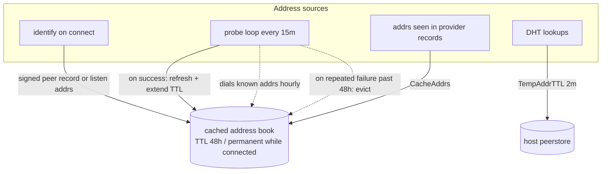
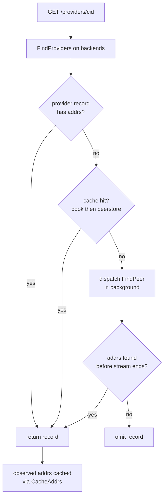
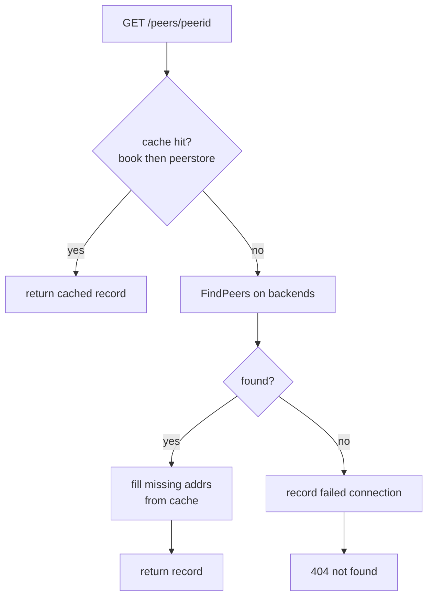

# Peer Address Caching

someguy is a caching delegated routing proxy, not a libp2p node. It answers
`/routing/v1` requests by querying backends (the Amino DHT and delegated HTTP
routers) and caching what it learns. Because it serves clients rather than
participating in the network itself, it prioritizes two things over a fresh
lookup on every request:

- **Latency.** A cached answer returns in microseconds; a DHT walk takes
  seconds.
- **Stable, reachable peers.** The cache holds peers that someguy has recently
  seen and actively probes, so cached addresses skew toward peers that are
  online right now.

This document describes how the address cache is filled, how it is kept fresh,
and how `/providers` and `/peers` read from it.

> [!NOTE]
> Address caching requires a DHT-backed instance and the `--cached-addr-book`
> flag (on by default). With `--dht=disabled`, someguy is a plain proxy:
> `/providers` and `/peers` forward to the delegated HTTP endpoints and no
> address caching takes place.

## The two stores

someguy keeps peer addresses in two places, both consulted through one read
path (`cachedAddrBook.GetCachedAddrs`):

| Store | Lifetime | Filled by |
| --- | --- | --- |
| **Cached address book** (`cachedAddrBook`) | 48h (`DefaultProvideValidity`) for direct addresses, a shorter `DefaultRelayAddrTTL` for `/p2p-circuit` relay addresses, or permanent while connected | identify events, the probe loop, and addresses observed in provider records |
| **Host peerstore** (`host.Peerstore()`) | 2 minutes (`TempAddrTTL`) | the DHT, which records provider and peer addresses during its own lookups |

The cached address book is the durable, probed store. The host peerstore is a
short-lived window onto whatever the DHT touched in the last two minutes, read
as a secondary fallback.

## How the cache is filled and kept fresh

```mermaid
flowchart TD
    subgraph sources [Address sources]
        ID[identify on connect]
        PROBE[probe loop every 15m]
        PROV[addrs seen in provider records]
        DHT[DHT lookups]
    end

    ID -->|signed peer record or listen addrs| CAB[(cached address book<br/>TTL 48h / permanent while connected)]
    PROBE -->|on success: refresh + extend TTL| CAB
    PROV -->|CacheAddrs| CAB
    DHT -->|TempAddrTTL 2m| PS[(host peerstore)]

    PROBE -.->|dials known addrs hourly| CAB
    PROBE -.->|on repeated failure past 48h: evict| CAB
```

Addresses enter the cached address book whenever someguy sees a peer: a
successful connect and identify, an address embedded in a provider record
(`CacheAddrs`), or a successful probe. Each sighting resets the entry's TTL to
48 hours, so a frequently requested peer never expires.

The probe loop runs every 15 minutes. For every cached peer not contacted in
the last hour, it dials the known addresses:

- **Success** extends the addresses toward a permanent TTL and clears the
  failure counter.
- **Failure** doubles a backoff (1h, 2h, 4h, ...). After repeated failures past
  48 hours, someguy evicts the peer.

This keeps the cache self-healing. Online peers are reverified about hourly;
dead peers are purged. A cached answer is therefore at most about an hour stale
in the common case, which is an acceptable trade for avoiding a DHT walk per
request.

A completed identify also prunes. Addresses otherwise only accumulate: provider
records, DHT gossip, and successive identifies each add to the union, so a peer
can collect outdated certhashes, dead relay circuits, and rotated NAT ports.
When an identify completes (organically or via a probe), someguy replaces the
peer's stored set with its current advertised addresses, taken from the signed
peer record when present and otherwise from the identify listen addresses, kept
together with any live-connection address so an active session is never dropped.
A reachable peer therefore collapses back to its current advertised set on each
refresh instead of growing without bound.

## Relay addresses

A `/p2p-circuit` (relay) address is far more perishable than a direct one. A
relay grants a reservation for at most its reservation TTL
(`relay.DefaultResources().ReservationTTL`, one hour by default) and drops it the
moment the peer disconnects from the relay, so a relay address can die within
minutes of being learned. A NAT'd node also advertises many at once: it reserves
on a couple of relays, and each relay is reachable over several transports, so
one peer often lists a dozen or more relay addresses.

someguy handles these addresses on their own terms:

- **Shorter TTL.** Relay addresses are cached under `DefaultRelayAddrTTL` (twice
  the relay reservation TTL) rather than the 48h used for direct addresses. The
  probe loop renews this for peers that are still reachable, so live relay-only
  peers stay cached while dead relays age out within hours.
- **Listed last.** `/providers` and `/peers` return direct addresses before
  relay addresses, so a client dials a directly reachable address first and
  falls back to a relay only when it must.

## How each endpoint reads the cache

Both endpoints are cache-first and share the same read path. They differ only
in shape: `/providers` streams many records, so it resolves missing addresses in
the background; `/peers` resolves a single peer, so it falls back inline.

### `/routing/v1/providers/{cid}`

```mermaid
flowchart TD
    REQ[GET /providers/cid] --> FP[FindProviders on backends]
    FP --> REC{provider record<br/>has addrs?}
    REC -->|yes| EMIT[return record]
    REC -->|no| CACHE{cache hit?<br/>book then peerstore}
    CACHE -->|yes| EMIT
    CACHE -->|no| DISPATCH[dispatch FindPeer<br/>in background]
    DISPATCH --> WAIT{addrs found<br/>before stream ends?}
    WAIT -->|yes| EMIT
    WAIT -->|no| DROP[omit record]
    EMIT --> SEEN[observed addrs cached<br/>via CacheAddrs]
```

A provider record often arrives with addresses already attached, in which case
someguy returns it as is and caches the observed addresses. When a record has no
addresses, someguy consults the cache; on a miss it dispatches a background
`FindPeer` so the stream keeps flowing. Records still missing addresses when the
stream ends are dropped.

A background `FindPeer` keeps running after the request that triggered it ends,
because finishing it fills the cache for whoever asks next. That also means a
client can disconnect and leave the work behind, so these lookups are capped
per instance by
[`SOMEGUY_CACHED_ADDR_BOOK_MAX_CONCURRENT_FIND_PEERS`](environment-variables.md#someguy_cached_addr_book_max_concurrent_find_peers).
At the cap the lookup is skipped and the record is dropped, the same as for a
peer under connect-failure backoff. The default sits more than an order of
magnitude above what normal traffic uses, so it only engages far outside it.
Watch `someguy_cached_router_find_peer_lookups_rejected` in
[metrics.md](metrics.md) to confirm that stays true.

### `/routing/v1/peers/{peerid}`

```mermaid
flowchart TD
    REQ[GET /peers/peerid] --> CACHE{cache hit?<br/>book then peerstore}
    CACHE -->|yes| EMIT[return cached record]
    CACHE -->|no| FP[FindPeers on backends]
    FP --> FOUND{found?}
    FOUND -->|yes| ENRICH[fill missing addrs<br/>from cache] --> EMIT2[return record]
    FOUND -->|no| FAIL[record failed connection] --> NF[404 not found]
```

someguy checks the cache first and returns immediately on a hit, without
touching the DHT. Only on a miss does it fall back to peer routing; a record
that comes back without addresses is enriched from the cache, and a peer that is
not found is recorded for backoff before returning a 404.

## Why cache-first

As a proxy, someguy returns a fast answer built from peers it knows are
reachable rather than blocking every request on a DHT walk. The cache already
favors online peers through active probing, so a cache-first answer is both
faster and biased toward peers a client can actually dial. Worst-case staleness
of roughly an hour is an acceptable price, as most stable peers keep stable
addresses over such a window.

Both endpoints follow this rule: they read the cache first and fall back to a
DHT lookup only when the cache cannot answer.

## Deliberate trade-offs

Several things someguy does not do look like oversights. They are choices, and
the reasoning behind them is not visible in the code.

### Records without addresses are dropped, not returned as bare peer IDs

A provider record whose address lookup fails is omitted from the response.
someguy could return the peer ID alone and let the client resolve it, and the
[spec has a way to ask for that](https://specs.ipfs.tech/routing/http-routing-v1/#filter-addrs-providers-request-query-parameter):
`filter-addrs=unknown` means "keep providers whose multiaddrs are unknown".
someguy does not honor it today, because the cache fallback drops those records
before the filter layer ever sees them.

The reason is what a client does next. Its only move is to call
`/routing/v1/peers/{peerid}`, which reaches the same someguy that just failed
to resolve that peer, and runs the same DHT walk. One response with a handful
of address-less providers becomes a handful of peer lookups, each taking
seconds.

Which way that trade should go depends on the client. A browser page shares one
connection pool across everything it loads, and a client that fans out on every
record can saturate its own request budget and effectively DoS itself, while
someguy pays for every walk anyway. Resolving once on the server and sharing
the answer through the cache spends someguy's resources instead of the
browser's, and someguy has more of them. See [who this is tuned
for](response-streaming.md#who-this-is-tuned-for).

Some of those peers are also withheld on purpose. A peer under connect-failure
backoff never gets a lookup dispatched at all, so passing its ID to a client
would send it after a peer someguy already knows is unreachable.

If a client can run its own DHT queries and wants the raw IDs, wiring up
`filter-addrs=unknown` is the supported path. It needs the filters to reach the
router, which the boxo HTTP server does not pass through today.

### A background lookup is not aborted when the client disconnects

Closing the connection stops delivery, but the dispatched `FindPeer` keeps
running on its own context for up to `DispatchedFindPeersTimeout`. Finishing
the lookup fills the cache, so the next client asking for that peer gets an
instant answer instead of paying for the same walk.

The cost is that a cheap request can leave expensive work behind, which is what
the concurrency cap above exists to bound. Without it, a client could open
requests, close them immediately, and leave an unbounded pile of DHT walks
running.

### `/peers` is not capped the same way

The cap covers background lookups only. A direct `/routing/v1/peers/{peerid}`
request runs on the request context, so it stops when the client disconnects
and cannot outlive the request. Its concurrency is bounded by how many requests
are in flight.

Skipping a lookup also means something different on each path. For a background
lookup the record is quietly omitted, which the client cannot tell from a peer
that had no addresses. For a direct request it would mean failing a request a
client is actively waiting on. The direct path has a different weakness worth
knowing: it consults no backoff, so a repeated request for an unresolvable peer
pays a fresh DHT walk every time.

### Nothing is persisted across restarts

someguy passes no datastore to the DHT, so value records, including IPNS
records written through `PUT /routing/v1/ipns/{name}`, live in memory and are
lost on restart. The address cache is in memory too.

Adding a persistent datastore is possible and small, but it buys little as
deployed. A `PUT` lands on one instance behind the load balancer, and a later
`GET` lands on any of them, so a per-instance store answers only a fraction of
reads. What actually makes a record retrievable is the DHT publish that the
`PUT` already performs. Persistence would need a datastore shared across
instances, and keeping a record alive past its expiry would need a republish
loop. Both are design work rather than configuration.
